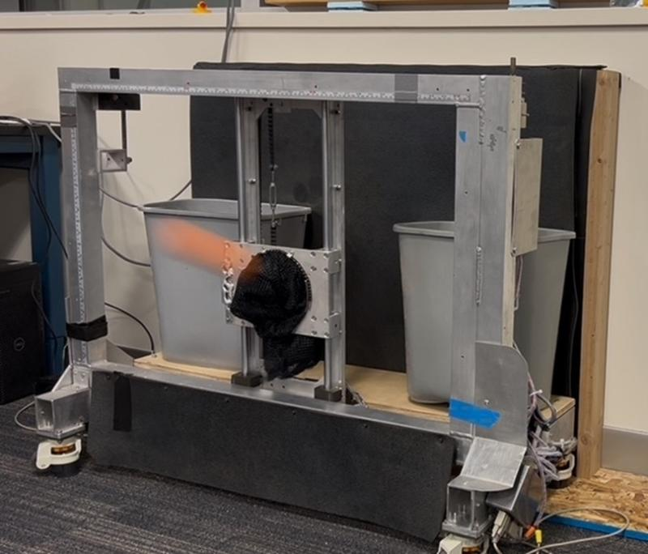
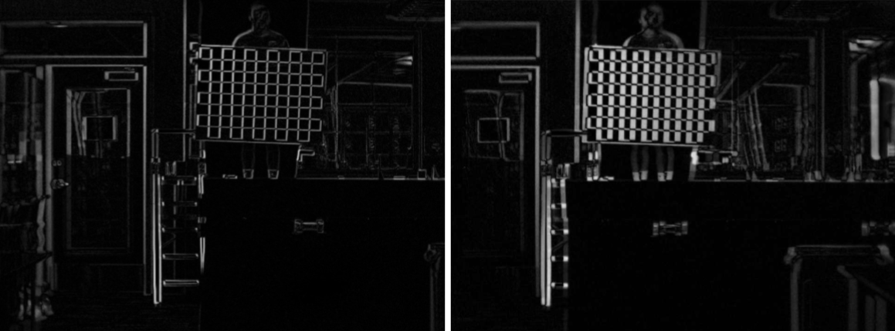
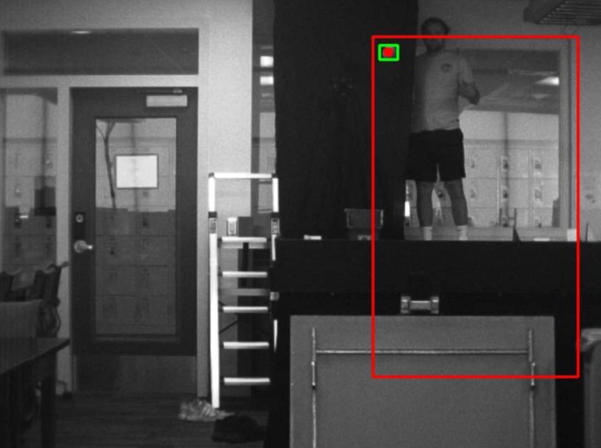
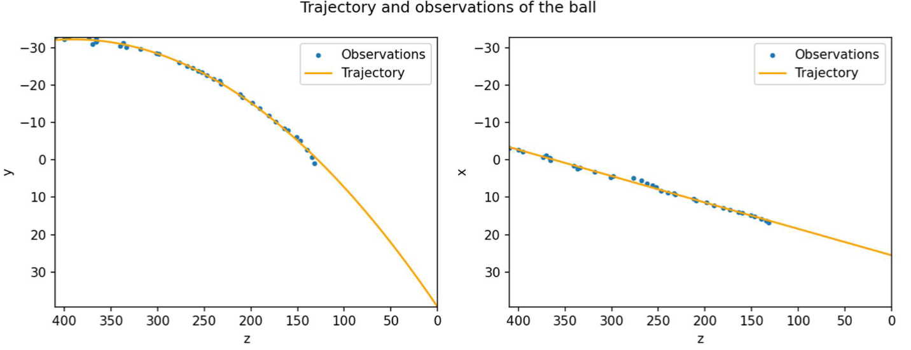

# Project Description
I built a system to automatically track and catch a baseball. We caught 17/20 balls—even when they were launched at nearly 60 mph! A video can be found at https://youtu.be/q1axb1CDXnk

⚡ The challenge? We had only a fraction of a second to detect, track, and predict the ball’s landing point.
🔍 How it works:
 ✅ Stereo Vision Calibration: Calibrate a stereo camera system to determine the precise rotation and translation between the two cameras.
 📸 Real-time Ball Detection: Capture images using the stereo system
 🎯 Contour Mapping: Dynamically track the ball using a contour map on the absolute difference between images
 🛠 3D Positioning: Map 2D pixel coordinates into 3D space using stereo calibration parameters.
 📈 Trajectory Prediction: Apply a 2nd-degree polynomial interpolation to estimate the ball’s flight path.
 🤖 Automated Catching: Position the catcher to intercept the ball at the predicted impact point.

# Stereo Calibration
The first step of the project was to calibrate a stereo system of cameras. I gathered three sets of images:
- Chess boards for the left camera
- Chess boards for the right camera
- Chess boards for both cameras
The first two sets were used to find the intrinsic and distortion parameters of each individual camera. The last one was to find the extrinsic parameters (rotation matrix and translation vector) between the two cameras. (For more information, refer to the pdf [3DReconstruction.pdf](StereoCalibration/BaseballCatcher.pdf)

After the images were captured, I used OpenCV to calibrate each image (similar to the Calibration project). I also used the function stereoCalibrate() to get the fundamental and essential matrices. Furthermore, I used the stereo calibration parameters to rectify each image, so that the epipolar lines are horizontal. An image showing the absolute differences after rectification is shown below:

# 3D Trajectory
The next step was to design a system to track the baseball on each camera and then use the coordinates to estimate the 3D trajectory of the moving baseball (For more information, refer to the pdf [3DReconstruction.pdf](3DTrajectory/3DReconstruction.pdf)

**Tasks 1 and 2:** In the first two tasks, I used and cv.triangulatePoints() and cv.perspectiveTransform() to map the 2D coordinates of the points of the chessboard into a 3-D domain.

**Task 3:** In this task, the goal was to find the pixel coordinates of the baseball in each frame of a video of one being launched towards the camera. I used OpenCV to find the absolute difference between each image. Then, I found the largest contour of the absolute difference that met a specified threshold. Furthermore, to reduce computation time and increase accuracy, I defined a region of interest in each image based on the location of the baseball in the previous frame. An example output for one frame in this task is shown below:

**Task 4:** In this task, I used the pixel coordinates of the baseball in each camera at the same time frame to estimate the 3D coordinates with respect to the middle of the cameras. The first thing I did was remove all frames where the ball is only detected on one of the cameras. Then, for each frame where the ball was detected in both, I undistorted the coordinates of the ball and the passed them into cv.triangulatePoints() to get a 3D projection. Finally, using the 3D points at each frame, I used a simple linear polynomial interpolation to predict the x-coordinates and a quadratic interpolation to estimate the y-coordinates at the time of impact with the z-axis. For results, see the image below:

