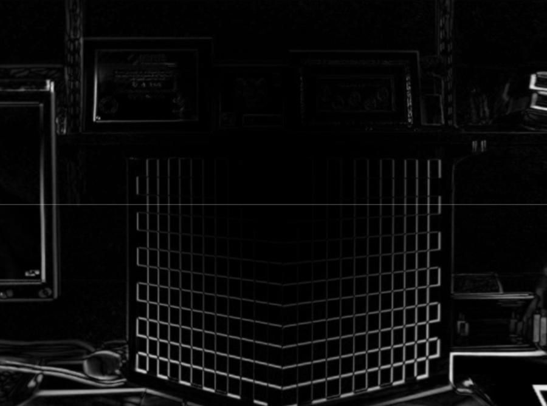

# Project Description
In this project, the goal was to learn how to calibrate a camera. In other words, the goal was to learn how to ge the intrinsic and extrinsic parameters of any given camera. The first step was to collect many photos of a chessboard. For more information, refer to [Calibration.pdf](Calibration.pdf)

Tasks 1-4 use the data I was given. Tasks 5 and 6 use images captured from my own web camera.

# Task 1
In this simple task, I used OpenCV's function findChessboardCorners() to find the corners of the chessboard in a given image. Then, I used the function cornerSubPix() to refine their locations. The output is shown in the image below

# Tasks 2 and 5
In this task, I passed in the coordinates of the corners of the chessboard into OpenCV's calibrateCamera() to get the intrinsic and distortion parameters. The matrices and vectors are recorded on the pdf [Calibration.pdf](Calibration.pdf)

# Tasks 3 and 6
In these tasks, I used the distortion parameters to visualize how distorted the original images actually are. I did this by undistorting the image and taking the absolute difference with the original. The results are shown below:

# Task 4
In this task, I passed in coordinates into OpenCV's solvePnP() to calculate the rotation matrix and translation vector.