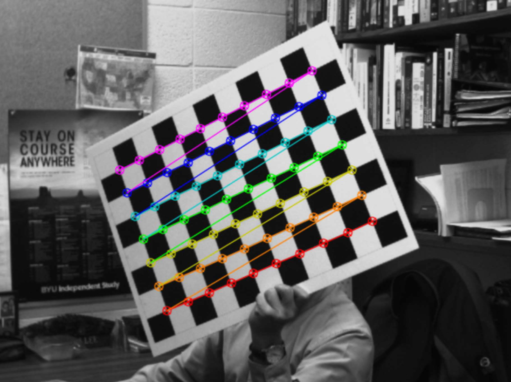

# Project Description
In this project, the goal was to learn how to calibrate a camera. In other words, the goal was to learn how to ge the intrinsic and extrinsic parameters of any given camera. The first step was to collect many photos of a chessboard. For more information, refer to [Calibration.pdf](Calibration.pdf)

# Task 1
In this simple task, I used OpenCV's function findChessboardCorners() to find the corners of the chessboard in a given image. Then, I used the function cornerSubPix() to refine their locations. The output is shown in the image below

# Task 2
In this task, I passed in the coordinates of the corners of the chessboard into OpenCV's calibrateCamera() to get the intrinsic and distortion parameters. The matrices and vectors are recorded on the pdf [Calibration.pdf](Calibration.pdf)

