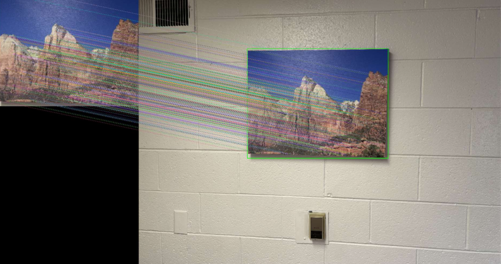

# Project Description
In this project, I recorded a video of a camera moving around a picture frame and replaced the picture frame with a photo of Nacho Libre from the Internet, as if the picture frame was a tv screen. This project was split into two tasks:

# Task 1
In this task, I cropped out a picture from the frame an the wall and used it as the reference image. Then, I used OpenCV's SIFT class to extract features. Finally, I used a KNN algorithm to match the features on every frame and passed in the points to find the homography matrix.

# Task 2
For this task, I transformed the picture frame on the wall with on image of Nacho Libre. I used SIFT to find features on both images, match them, and get a contour around the features in the frame from the video. I removed the matched features where the
distance was too large and then transformed the image onto the video.

Originally, the output was quite noisy. This is probably because of my inconsistent movement in the video. This caused the frames to be quite blurry. So, I stored all the results in an array, marking which frames made dramatic jumps. Then, I used post-processing to remove the noise and replace it with an interpolation between the frames that were transformed correctly. This prevented the model from working real time, but greatly improved accuracy. A Youtube video of my results is shown below:

