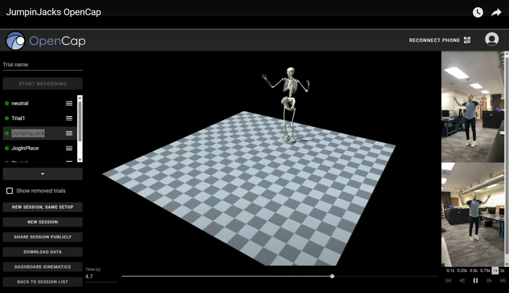
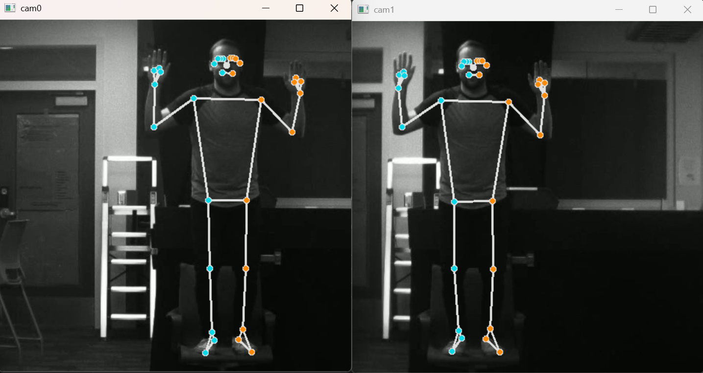
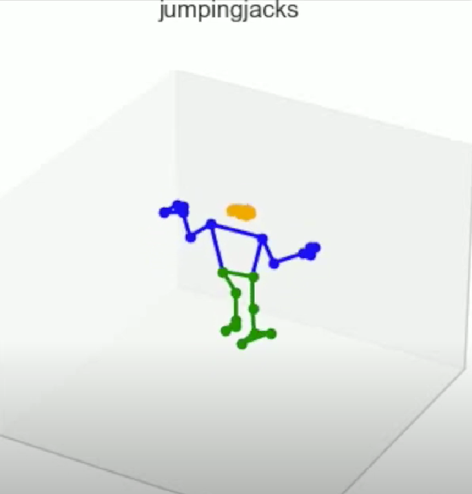

# Human Pose Estimation Using MediaPipe
This respository performs Human Pose Estimation. Our project is inspired in-part by https://www.opencap.ai/, though none of their code is used. The end goal is to take in a video (pre-recorded or live) of a person performing an athletic action (jumping jacks, jogging, squats, e.t.c.) and output the 3-D coordinates of the person's joints (ankle, knee, hip, nose, e.t.c.) during the movement. This will give us data that can be used in future research to better understand human motion during physical activity.

An example video using the OpenCap Software is below (at https://www.youtube.com/watch?v=9lfWcKHDAeM)

Our code is based on Google's mediapipe https://ai.google.dev/edge/mediapipe/solutions/guide. The python library can be used to get 2-D coordinates of human joints in a frame. It only works for one human  at a time and works by finding the region of interest and passing the pixel values into a deep neural network. For more information about the indices of each joint, refer to https://roboflow.com/model/mediapipe.

# Live 2-D Pose Estimation
The first step of the model is to take in a frame (from a video or live recording) and output the pixel coordinates of each joint. This is a relatively straightforward process, thanks to MediaPipe. The file ``bodypose3d/bodypose2d_love.py`` records a video using the webcam, displays the video with circles drawn at each joint, and saves the output coordinates into the file ``kpts_cam.dat``. The files has num_frames rows and 2 x num_joints rows (for the x,y pixel coordinates of each joint).

The coordinates will only be saved if write_output is set to true. A corresponding video will be saved at ``camera.mp4`` if save_video is set to true.

An example video is found in the link (or image) below https://youtu.be/qfqO7u3DNLc

# 3-D Pose Estimation
The next goal of the project is to map the pixel coordinates of each joint into a 3-dimensional domain. This requires the use of two cameras, in a stereo calibrated system. Calibration parameters are needed (intrinsic, extrinsic, and the rotation and translation between the cameras). 

Currently, the code is not setup for live 3-D pose estimation, as it requires a system that can capture images from two sepearate cameras at the same time (while also allowing for installing of packages like OpenCV and MediaPipe). But, the code does work for pre-recorded videos from a stereo system with known parameters.

The 3D pose estimation is done in ``bodypose3d_fromvideo.py``. The stereo calibration parameters are stored in the top as mtxL, distL, mtxR, distR, T, R0, R1, P0, P1. It is asusmed that two videos are stored in files at the locations ``data/[action_name]/left_original.avi`` and ``data/[action_name]/right_original.avi``. The frames of each video must be synchronized so that the frame numbers correspond to the same point of time. 

This code takes in the video sequence for each camera and uses MediaPipe to get the 2-D coordinates of each joint in every frame (similar to the previous file explained above). Then, using the stereo calibration parameters, these coordinates are mapped into a 3-dimensional domain.

Two different methods are used to get the 3-D coordinates. The first one uses the DLT method. The second, uses OpenCV functions to undistort the coordinates and triangulate them. Both methods yield similar results.

If write_output is set to true, four files are created. ``kpts_cam0`` and ``kpts_cam1`` store the 2-D pixel coordinates of each joint in every frame, which were found by MediaPipe. ``kpts_3d`` stores the 3-D coordinates found from the DLT method. And, ``kpts_3d2`` does the same, but using the 3-D coordinates from the second method. If save_video is set to true, videos of the coordinates for each camera are saved in ``left_camera.mp4`` and ``right_camera.mp4``.

# 3-D Pose Visualization
The next step is to take in the 3-D coordinates them and visualize them frame-by-frame. The ``bodypose3d/show3dpose.py`` file does this. It takes in the data of the coordinates, which is assumed to be stored at ``data/[action_name]/kpts_3d.dat`` or ``data/[action_name]/kpts_3d2.dat`` (depending on the method used). Then, it creates a video to visualize the coordinates. This code should later on be merged with the previous file to provide real-time 3-D visualizations.

Since the output can often be noisy, if you set smooth to True, the code will apply a Gaussian filter to smooth out the coordinates. This will lead to more appealing visualizations. Though, the exact coordinates given may not be 100% accurate.

Setting save_video to true will save a video of the output within the directory of the coordinate files. This code is not optimized at all to save the video and runs quite slowly. This is because the each frame in the video is a new initailization of the plot. To make this quicker, it is recommended to replace the current code with matplotlib's FuncAnimation library.

An example video for some of the results can be found by selecting the image below or using the link https://youtu.be/XuF4HiqkiD4?si=_tI-wUqVkcEOWXR9

Note: The limits of the plots are hard-coded in to help with visualization for the specific stereo system the problem was tested on. These may need to be edited for a different stereo system.