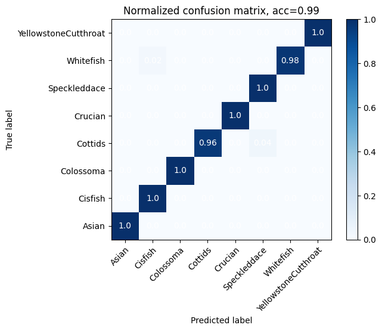
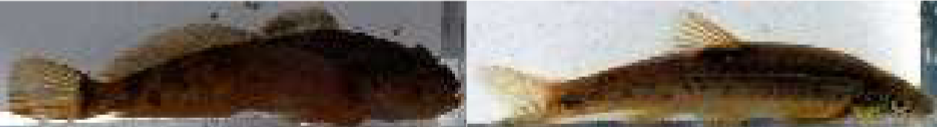
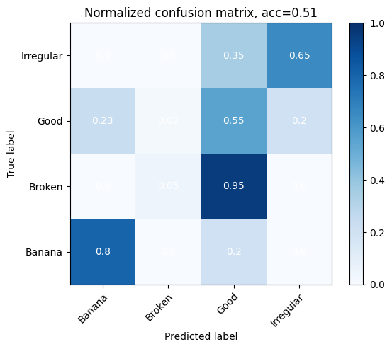
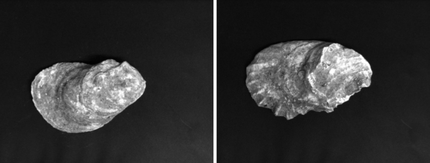

# Project Description
For this task, the goal was to PyTorch to classify various fish species and oyster shells. Since I am already familiar with YOLO, I chose to use a ResNet50: a state-of-the-art Convolutional Neural Network in image classification. It has approximately 25.6million parameters, making it capable of classifying images in a wide variety of tasks.

Additionally, for each task, I used torchvision.transforms to augment the training
set. Specially, I randomly flipped the images with a 50% chance, randomly cropped and
resized them, randomly rotated them, added small random color changes, and added
small random translations. These augmentations expanded the training set and made the
model more robust. Furthermore, I normalized the data for both the training and test sets to
ensure consistency across training. 

For more information, refer to the pdf [Description and Results](ImageClassification.pdf)

- ⚠️ **Dataset not included** – Due to its size, the dataset used for training and testing is not included in this repository.

# Fish

The ResNet50 worked very well for the fish species dataset, as you can see in the
confusion matrix for the test set. The only problems we seemed to run into was that only
98% of the Whitefish were predicted correctly (the other 2% were classified as Cisfish) and
only 96% of the Cottids were predicted correctly (the other 4% were classified as
Speckleddace)

Upon further examination, here are two example images below. The left image is a
Cottid and the right is a Speckeddace. It appears that both fish have similar colors, and
relatively similar shapes. So, I can see why the model at times struggled to tell the
difference between the two of them. Fortunately, the differences are distinct enough that
these inaccuracies only happened 4% of the time, and only as False negatives for the
Speckleddaces.

# Oysters

The ResNet50 did not work as well for this task. It appears that classifying the shape
of oyster shells is much more difficult. This makes sense because the images are gray
scale (which results in a loss of information). And, as a human, it is just more difficult to
determine what shape each shell should classify as. The confusion matrix is shown below.
The banana shells seemed to be the easiest to classify. But, hardly any shells were
classified as broken, and it was a toss up between good and irregular shells.

Upon further examination, here are two example images. The left image is classified
as “good” and the right one as “irregular”. The good shell seems to be slightly more smooth
than the other. But, it is honestly quite difficult to tell the difference for me. The algorithm
would have to notice subtle details about the texture and shape that an untrained eye just
would not notice. This explains why this task was much more difficult than the last. The
model did not fail; the task was just an inherently difficult problem.

