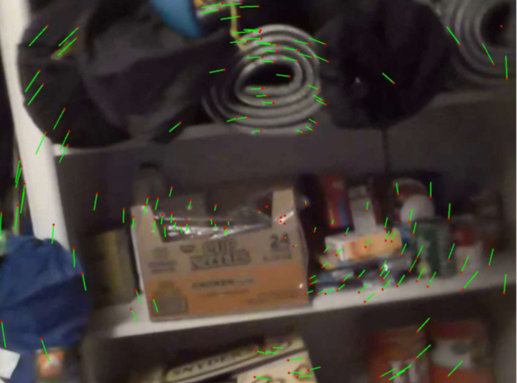
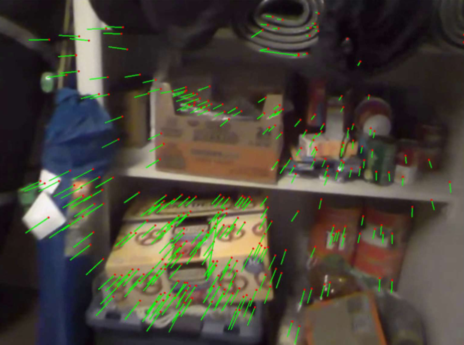
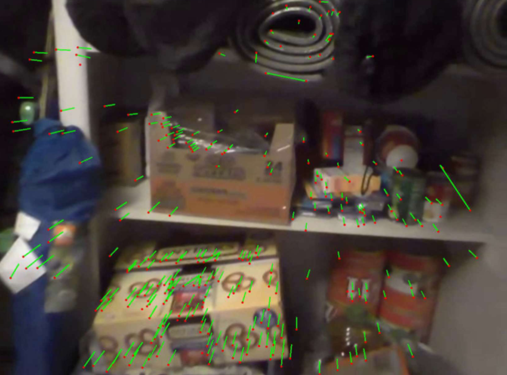
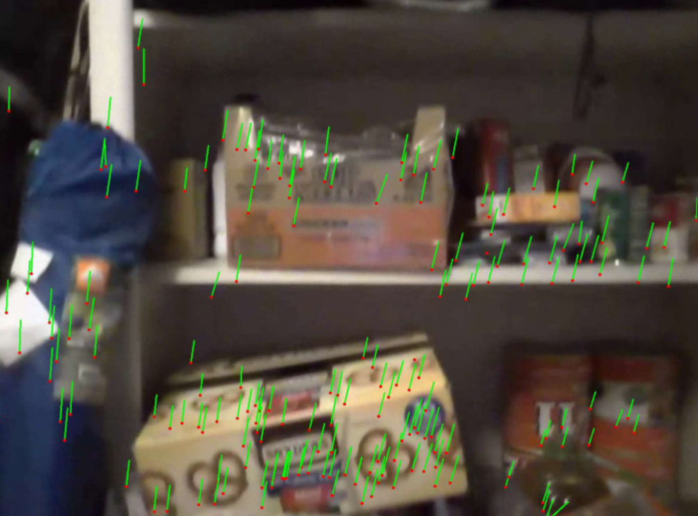

# MotionField
In this project, the goal was to understand the motion of a moving camera in a feature-rich scene. I used OpenCV to detect useful features in each frame and then matched them from frame to frame (with a 5-frame buffer) using various OpenCV methods. I then visualized the movement by displaying the features and their trajectories. I also calculated the rotation matrices and translation vectors for each movement.

For more information, refer to the pdf [Project Description and Results](MotionField.pdf)

# Task 1

In this task, I used goodFeaturesToTrack() to detect good features in each image.
Then, I used calcOpticalFlowPyrLK() to find points in the next frame and determine the flow
between the corresponding features. Furthermore, whenever the number of points was
less than 300, I called the goodFeaturesToTrack() function again to get 400 features.

After some fine tuning, I got desirable results. The video can be found at the link: . I found that the most optimal number of frames to skip was
5. This was small enough for the features to be close to each other, but far enough to allow
us to visualize the movement. I also used a pyramid level of 5 and window size of (21 x 21).
Both parameters were chosen after testing various values. To my surprise, they did not
seem to have that much of an effect on the results. This is likely because the movement in
the video was slow enough and the features were dense enough.

Overall, I learned that it is relatively straightforward to determine the motion of
features in a video. One has to do a lot of fine tuning to find an optimal window size and
pyramid level, based on the speed of the movement in the video. But, once those
parameters are determined, you can get satisfactory results (with some noise)

# Task 2

This time, with the same goal in mind, I used a template matching technique. To
calculate the motion, I skipped 5 frames (as it worked in the first task). I tried two different
things:

1) I used the ideas from the previous homework assignment. I set up a SIFT
detector and used BFMathcer() to match the points from frame to frame. Of the
matches, I took the best ones and used those to detect the movement of each
point. This worked well. But, it was a little slow. It is equivalent to using the
matchTemplate() function where the search window and template are the entire
image (and an optimized algorithm is used to remove features that are matched
too far away).

2) I tried using the goodFeaturesToTrack() function to find features. Then, I took a
window (of size 20 on each side) of the image around each feature for both the
new image and the old (template). After that, I called matchTemplate() to help
me determine how each feature moved across the image. This worked relatively
well. But, unfortunately, the points chosen at each frame were slightly diƯerent,
and the order in which they occurred always diƯered. So, I struggled to get good
results.

Overall, I think I prefer the method used in task 1, as it was faster and easier to use
for me. Feature matching works as well. It is easy to do if the whole image is used to
find features each time. It is likely more accurate and definitely much faster if a
small window around each feature is used. But, it is hard to keep track of which
points correspond to each other well without a lot of fine tuning and careful.
A video of the output from the best version can be found at:

# Task 3

For this task, I used my cameras intrinsic and extrinsic parameters, along with the
motion of the points to determine the fundamental, essential, rotation, and translation
matrices between the frames. Undistorting the points led to quite a bit of errors. So, since
my camera isn’t too distorted anyway, I found it optimal to pass in the points as is to the
OpenCV findFundamentalMat() function (the code for both is included). I found the
essential matrix using the given formula (and normalized it after taking the SVD). Then, I
used the recoverPose() function to find R and T. My results are shown below. The original
image is first displayed. It is followed by the new image where points and lines are drawn to
show how the image moved. Finally, for each type of movement, the matrices F, E, R, and T
are shown in the pdf [Project Description and Results](MotionField.pdf). The pdf also contain the rotation matrices and translation vectors.

