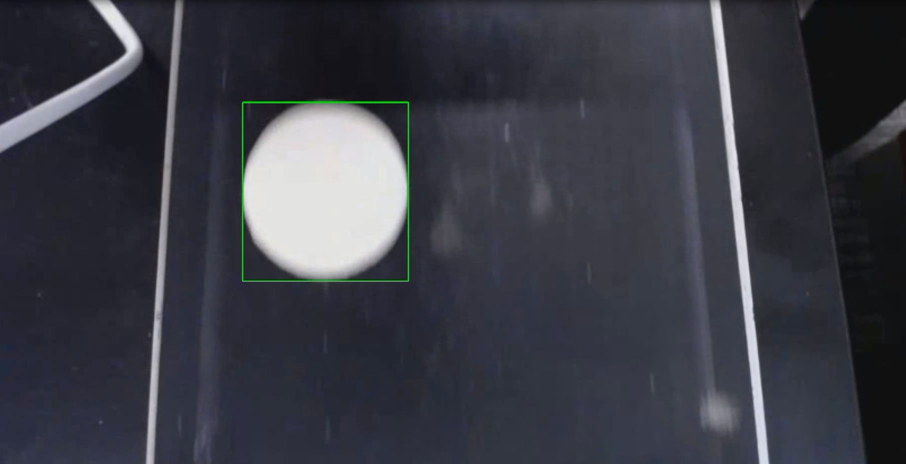
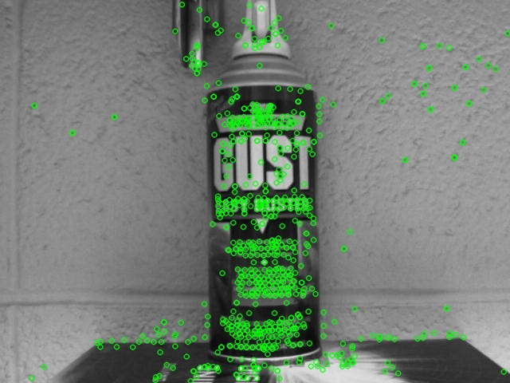

# RoboticVision
Various computer vision projects from BYU's grad course ECEN 631: Robotic Vision. Projects use openCV for topics such as stereo calibration, catching a baseball, visual inspection, and more.

# Visual Inspection
In this project, the goal was to create software that automatically classifies objects on a conveyer belt into three categories (Good, Bad, and Ugly) in real time. Specifically, we worked with Babybel cheese where "good" meant unopened, "bad" meant opened, and "ugly" meant partially eaten. We...

- Manually gathered our own data by recording videos of the cheese passing by on a conveyer belt at various speeds
- Hand-crafted our own features using old school computer vision methods on OpenCV
- Trained an SVM on the gathered data
- Achieved 92% accuracy on the training set and had good results on real-time tests.

  

# TimeToImpact
In this project, a series of images were captured from a camera moving toward a spray can. The objective was to estimate the **time to impact**—the moment the camera would collide with the spray can.

To achieve this, I applied classical computer vision techniques:
-
- Extracted key features from a reference image of the spray can
- Matched these features across frames to locate the spray can in each image
- Calculated a bounding box around the matched region in each frame
- Analyzed the change in bounding box size over time to estimate the camera's trajectory and predict the time to impact

This approach provided a simple yet effective way to model motion and depth perception using only 2D visual input.

  

