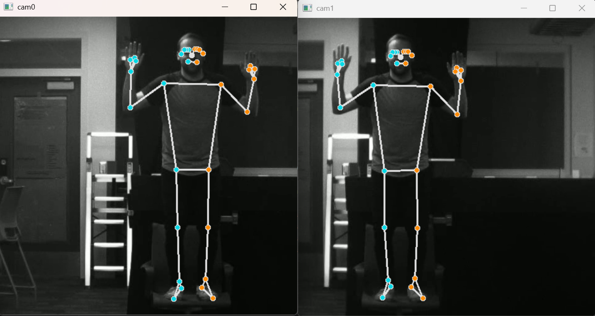
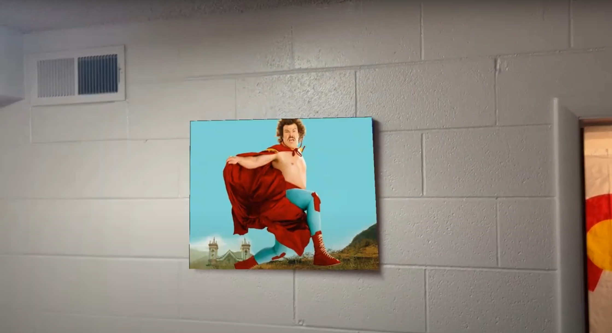
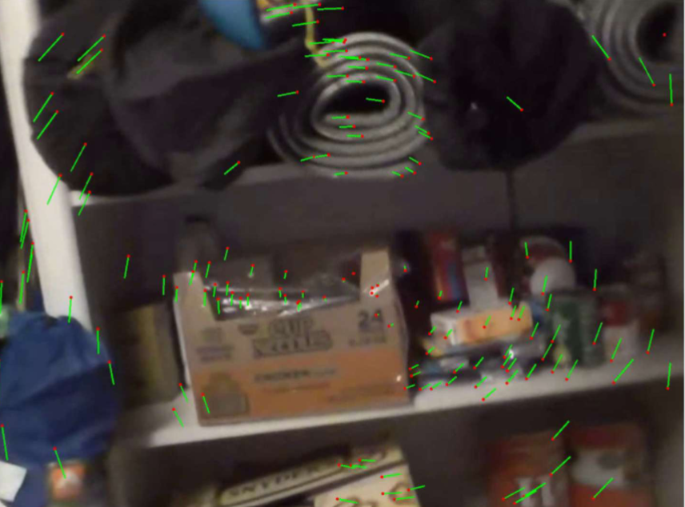
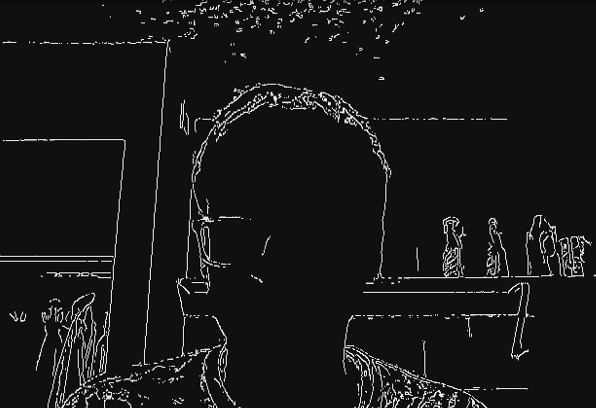

# RoboticVision
Various computer vision projects from BYU's grad course ECEN 631: Robotic Vision. Projects use openCV for topics such as stereo calibration, catching a baseball, visual inspection, and more.

# Human Pose Estimation (Final Project)
This project, inspired in-part by https://www.opencap.ai/, takes in a video (pre-recorded or live) of a person performing an athletic action (jumping jacks, jogging, squats, e.t.c.) and output the 3-D coordinates of the person's joints (ankle, knee, hip, nose, e.t.c.) during the movement. This will give us data that can be used in future research to better understand human motion during physical activity.

The first step of the model is to use MediaPipe to take in a frame (from a video or live recording) and output the pixel coordinates of each joint, as shown below. An example video can be found at https://youtu.be/qfqO7u3DNLc

  

The next goal of the project is to map the pixel coordinates of each joint into a 3-dimensional domain. Using the stereo calibration parameters, the 2D coordinates for each camera are mapped into a 3-dimensional domain. Then, the 3D coordinates are visualized in a plot. An example video for some of the results can be found at https://youtu.be/XuF4HiqkiD4?si=_tI-wUqVkcEOWXR9

  

# Visual Inspection
In this project, the goal was to create software that automatically classifies objects on a conveyer belt into three categories (Good, Bad, and Ugly) in real time. Specifically, we worked with Babybel cheese where "good" meant unopened, "bad" meant opened, and "ugly" meant partially eaten. We...

- Manually gathered our own data by recording videos of the cheese passing by on a conveyer belt at various speeds
- Hand-crafted our own features using old school computer vision methods on OpenCV
- Trained an SVM on the gathered data
- Achieved 92% accuracy on the training set and had good results on real-time tests.

  

# Homography
In this project, I recorded a video of a camera moving around a picture frame and replaced the picture frame with a photo of Nacho Libre from the Internet. I clipped out the picture from from the video and used feature matching to find it in every frame. Then, I used a homography matrix to map an image of Nacho Libre onto the picture frame, in every frame of the video. After using interpolation to clean the noise, the resultant video shows the original picture frame being magically replaced by a photo of Nacho Libre, as if the picture frame was a tv screen.

  
  

# MotionField
In this project, the goal was to understand the motion of a moving camera in a feature-rich scene. I used OpenCV to detect useful features in each frame and then matched them from frame to frame (with a 5-frame buffer) using various OpenCV methods. I then visualized the movement by displaying the features and their trajectories. I also calculated the rotation matrices and translation vectors for each movement. An example image is shown below.

  

# TimeToImpact
In this project, a series of images were captured from a camera moving toward a spray can. The objective was to estimate the **time to impact**—the moment the camera would collide with the spray can.

To achieve this, I applied classical computer vision techniques:
- Extracted key features from a reference image of the spray can
- Matched these features across frames to locate the spray can in each image
- Calculated a bounding box around the matched region in each frame
- Analyzed the change in bounding box size over time to estimate the camera's trajectory and predict the time to impact

This approach provided a simple yet effective way to model motion and depth perception using only 2D visual input.

  

# Image Classification
For this task, the goal was to classify various fish species and oyster shells. Since I am already familiar with YOLO, I chose to use a ResNet50. Sample images and results for the fish classification are below:

  

  

# Calibration
In this project, the goal was to learn how to calibrate a camera. In other words, the goal was to learn how to ge the intrinsic and extrinsic parameters of any given camera. Given various photos of a chessboard, I found the locations of the corners and used them to find the calibration parameters. For more information, refer to [Calibration.pdf](Calibration/Calibration.pdf)

  

# openCV_Intro
This project was an intro to OpenCV. I learned how to use various openCV functions in real time, such as edge detection, line detection, corner detection, absolute difference, and contour maps. Also, I used these functions to detect images of a launched baseball.

  

