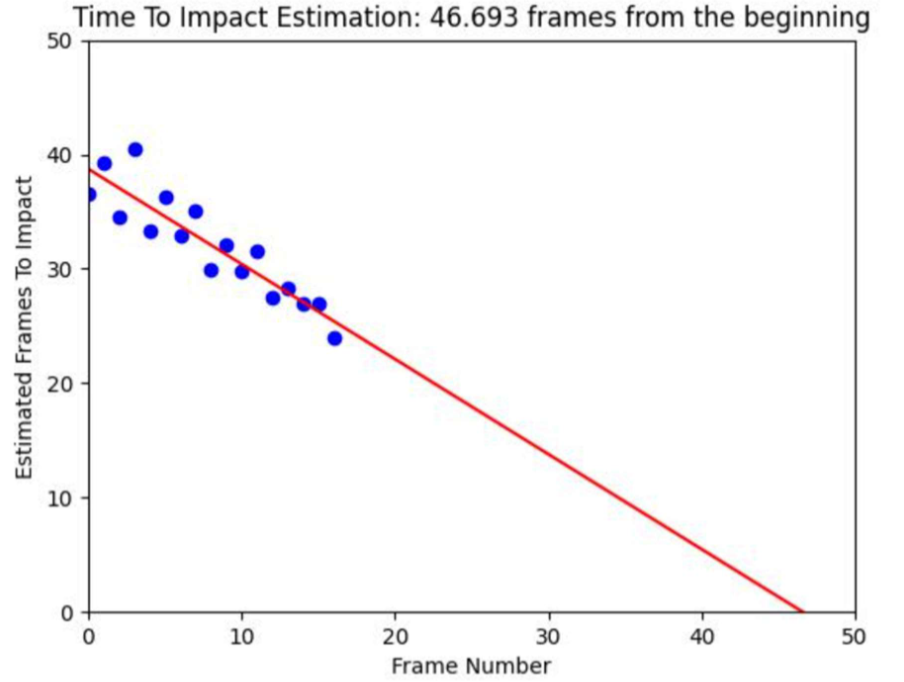
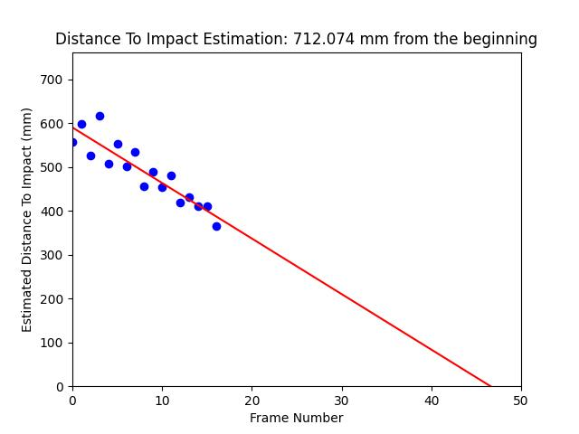
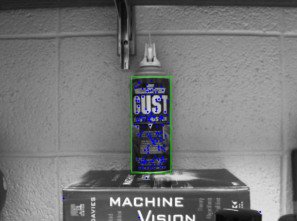
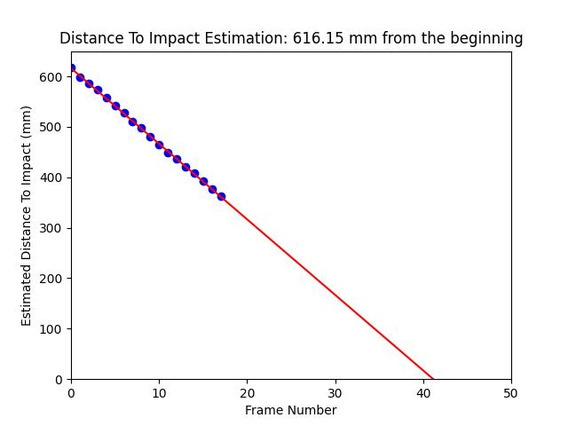

# TimeToImpact
In this project, a series of images were captured from a camera moving toward a spray can. The objective was to estimate the **time to impact**—the moment the camera would collide with the spray can.

To achieve this, I applied classical computer vision techniques:
- Extracted key features from a reference image of the spray can
- Matched these features across frames to locate the spray can in each image
- Calculated a bounding box around the matched region in each frame
- Analyzed the change in bounding box size over time to estimate the camera's trajectory and predict the time to impact (using the camera calibration parameters)

This approach provided a simple yet effective way to model motion and depth perception using only 2D visual input.

  

# Project Explanation

The project and results are also explained in the pdf file below:

[📄 View Project Report (PDF)](TimeToImpact.pdf)

# Task 1

For this task, I used SIFT to find features in each frame. I passed in those features
into a K-nearest-neighbor matching algorithm to determine which features match from
frame to frame. Then, for each matched feature, I calculated the distance to the optical
center. Using these distances, I used the formula provided in the slides to find the
expansion rate and estimate the time to impact. My results are shown in the plot below. The
prediction is that impact will occur in 46.693 frames (from the start).

# Task 2

This task was pretty straightforward. We were already given the information that the
image sequence was taken at 15.25 mm intervals (moving toward the gas can). So, all I had
to due was to multiply the estimated time to impact by 15.25 (to change the units). This led
to the prediction that the can started 712mm away from the camera.

# Task 3

This task seemed to be the most accurate. Rather than calculating the rate of
expansion for the pixels, I constrained the features to that of the gas can. I followed a
similar process to that of the homography homework by clipping out the gas can in one of
the image and extracting features.

Then, for each frame in the sequence, I only matched features on the gas can. Using
these matches, I was able to get a bounding box around the gas can which I then used to
find the width in pixels. Then, to find the distance to impact, I took the focal length times
the width of the gas can divided by the width of the frame in pixels. This had similar results
to the last problem. But it was much less noisy, meaning that it is more likely to be
accurate. My plot is shown below.

