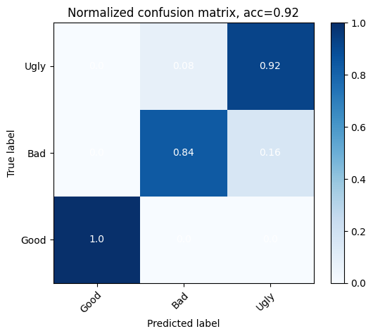

# Babybel Cheese Classification System

This project focuses on building a real-time computer vision system that classifies Babybel cheese on a conveyor belt into three categories:

- **Good**: Fully sealed and unopened  
- **Bad**: Opened packaging  
- **Ugly**: Partially eaten

## Overview

Using classic (non-deep-learning) computer vision techniques, we processed each video frame to extract contour maps and locate cheese objects. From these regions, we extracted hand-crafted features such as:

- **Texture** (LBP)
- **Shape**
- **Color**
- **Area**

These features were passed into a **Support Vector Machine (SVM)** classifier to categorize the objects.

## Data Collection

We recorded our own dataset by filming Babybel cheese moving on a conveyor belt at various speeds. All data was manually labeled and preprocessed for training.

## Results

- Achieved **92% accuracy** on the training set
- Performed well in **real-time classification tasks**
- Accuracy was highly sensitive to lighting conditions, emphasizing the need for more robust data or controlled environments

## Technologies Used

- Python
- OpenCV
- scikit-learn

## File Structure

- **`Training.py`** – Script for training the SVM model using extracted features
- **`VisualInspection.py`** – Real-time video analysis script; extracts contour maps from live video and displays predictions with colored overlays
- **`src/`** – Code for recording videos of Babybel cheese on the conveyor belt
- **`LBPSVM/`** – Reference project used as inspiration for extracting texture features (e.g., LBP) and training
- ⚠️ **Dataset not included** – Due to its size, the dataset used for training and testing is not included in this repository. A sample image of the real-time prediction for a "good" sample is below.

