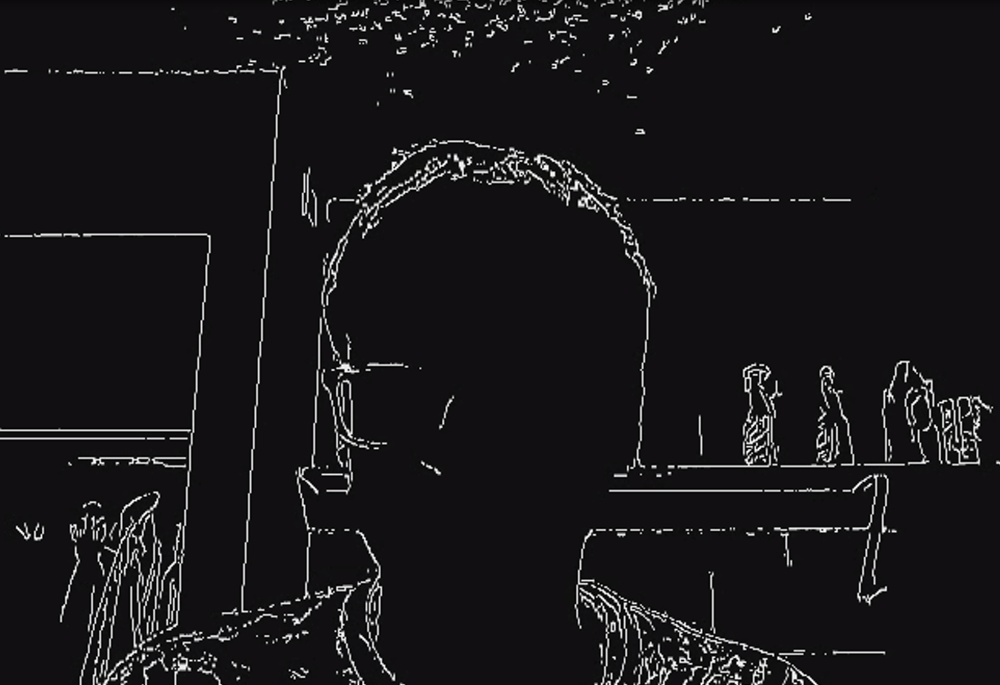
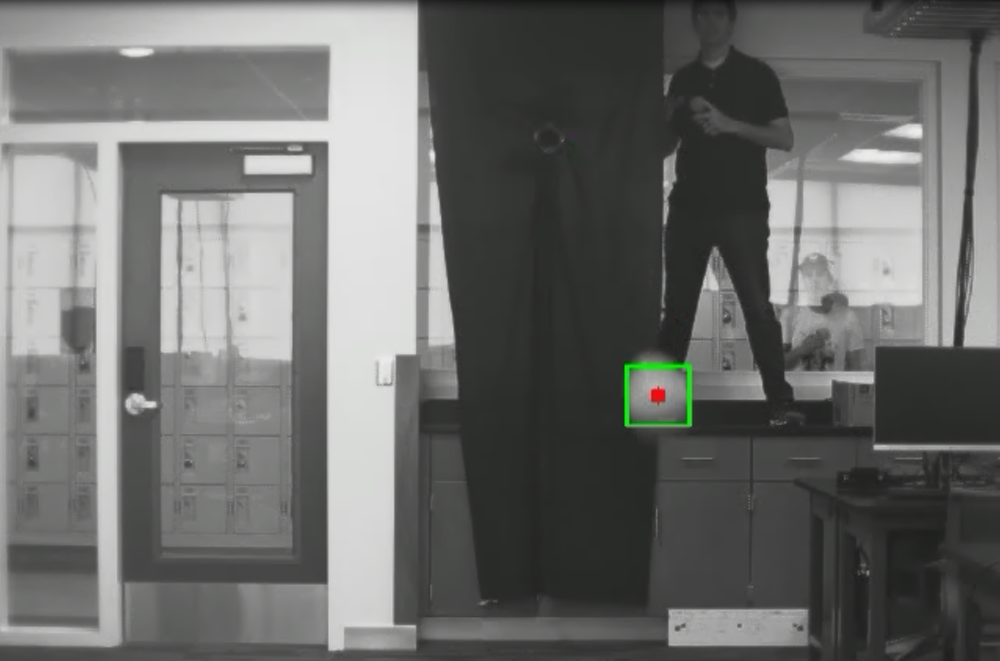

# Project Description
This project was an intro to OpenCV. I learned how to use various openCV functions in real time, such as edge detection, line detection, corner detection, absolute difference, and contour maps. Also, I used these functions to detect images of a launched baseball.

# OpenCV.py
This file uses the webcam to record a video. Then, it includes various buttons to display the results of various OpenCV functions in real-time.

# Baseball Tracking
I used contour maps to track a baseball in a sequence of frames.

For a video, use the link:

